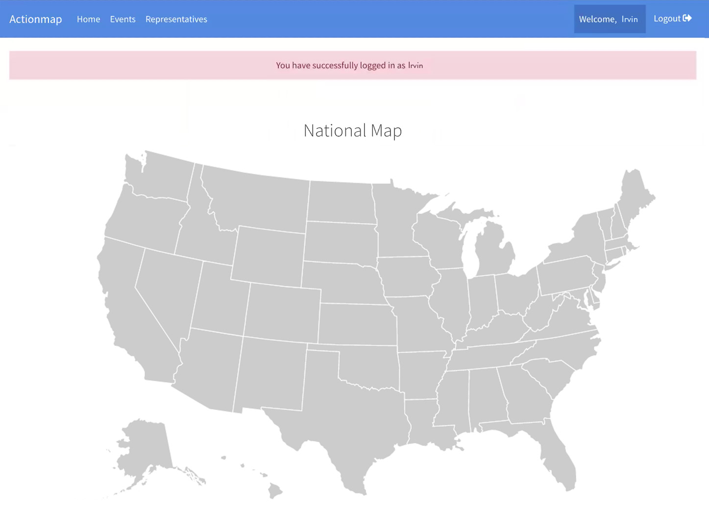
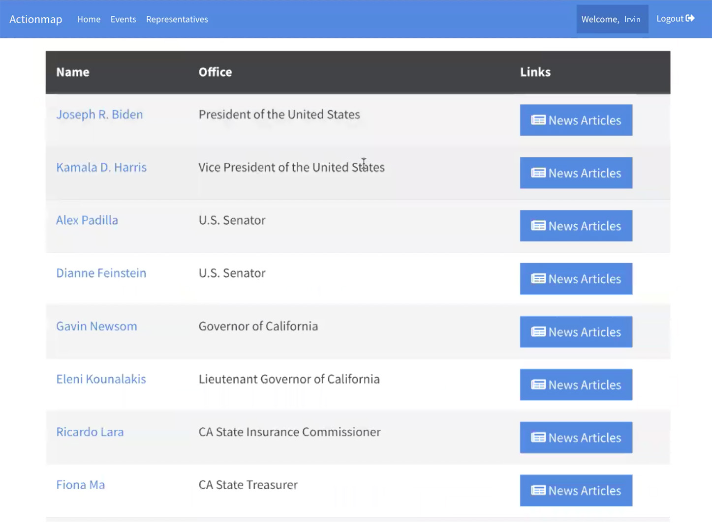
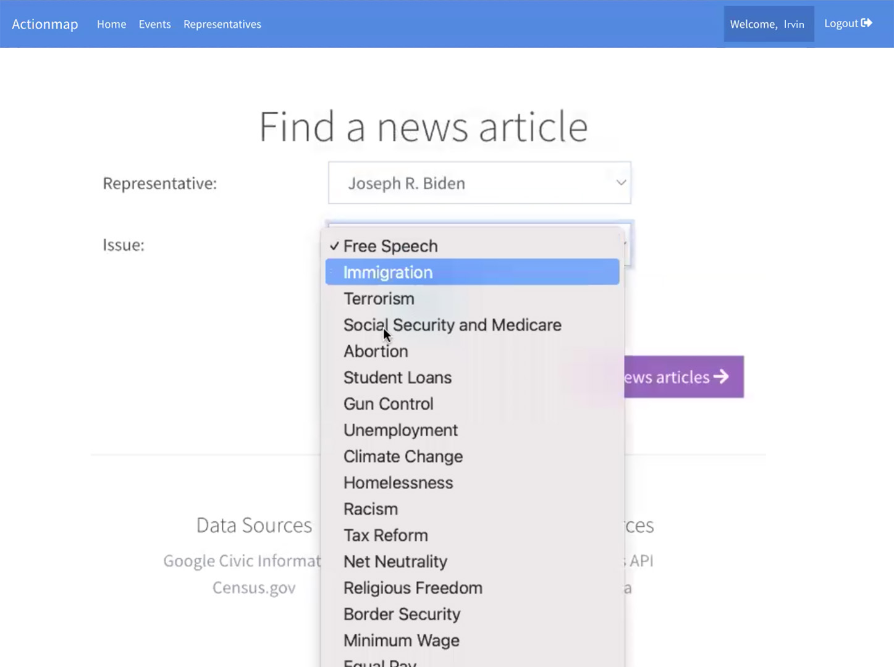

# Actionmap

[demo video](https://www.youtube.com/watch?v=K8rLec6Satc)

ActionMap seeks to bridge the gap between voters and the progressive community, leveraging technology to amplify the voices of the electorate.

Features:

- Enhanced Navigation: With our newly added top menu, users can now seamlessly navigate between our homepage, events, and a dedicated page for representatives.

- Google OAuth Integration: We've incorporated Google OAuth, ensuring a secure login experience. Once logged in, users will always be informed of their sign-in status.
- Find Your Representative: On our representatives' page, input your location and voila! Discover your representatives, sourced from the Google Civic API. Furthermore, each representative is accompanied by links to their bio and related news.

- Users can contribute by adding news articles relevant to an official, rating them based on the content. This fosters credibility and authenticity in the scoring process. Not just this, visualizing your political environment becomes easier as you can explore candidates through our map feature or even search using your address.

  
Now, diving deeper, developers will appreciate our foundational code structure. We offer a web_steps.rb file as starter code, and the first segment we are developing is the Representatives model. While it currently has basic functionality, we aim to expand upon this, drawing data from the Google Civic Information API.

Our tasks are outlined - from creating representative profiles, ensuring test coverage, to even refining our news articles segment with an external API. We aim to elevate the user experience, making political engagement not just informative but also intuitive.
